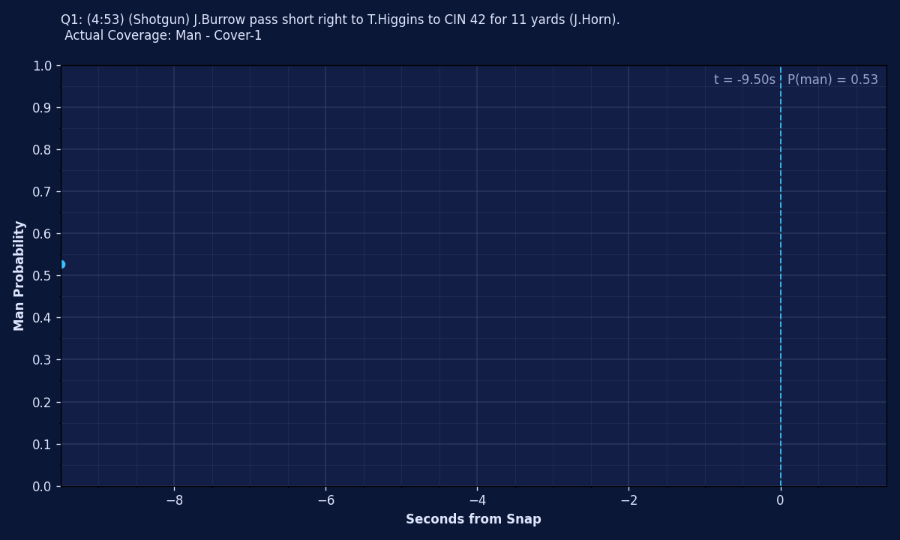
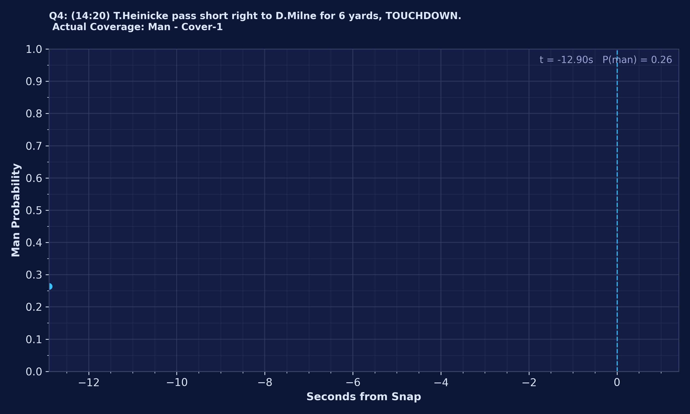
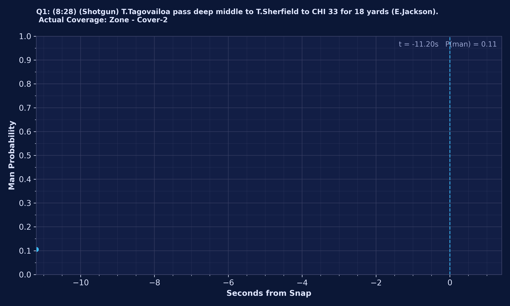
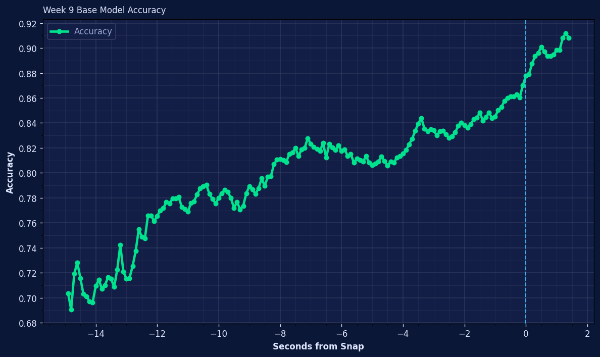

# Overview
This repo trains on the 2022 NFL Season Weeks 1 - 8 to predict man or zone pass coverage BEFORE the snap with machine learning. Week 9 plays are used for evaluation.

Two models are implemented:
- LSTM "naive" model that treats location tracking data as true time series inputs
- Transformer model that follows the SumerSports and SmitBajaj implementation

Both models yield about 88% accuracy in predicting man or pass coverage BEFORE the snap for all plays in Week 9 of the 2022 NFL season.

# Demo


### 2022 Week 9: Panthers at Bengals
Let's look at a play that goes swimmingly based on the coverage tell. On 2nd-and-8 against Carolina, Joe Burrow gets his coverage answer right away. He motions Tyler Boyd (#83) across the formation and C. J. Henderson (#24) travels with him. That’s a clean man-coverage indicator. Carolina is also crowding the line, showing pressure, so Burrow knows he’s in a quick-throw situation.

The route design plays perfectly off that read:
- Boyd’s motion and flat route pull Henderson toward the boundary
- Tight end Mitchell Wilcox (#84) pushes vertically and forces free safety Myles Hartsfield (#38) to gain depth through the middle
- Reciever Tee Higgins (#85) is isolated one-on-one with cornerback Jaycee Horn (#8). Higgins is running a curl, and Horn is aligned eight yards off to protect himself against the vertical stem, leaving plenty of space for the break.

With man coverage confirmed and pressure likely, Burrow hits the top of his drop and fires in rhythm. Higgins snaps off his curl into the open window Horn has surrendered, and Burrow delivers an easy first down created by the motion tell, the pressure look, and the spacing built into the concept.


Fortunately the model spots the same man coverage tell! Once Boyd goes in motion about 3 seconds before the snap with Henderson mirroring his movements, the model's predicted man coverage probabilty shoots up from under 20% to 90% at the snap.


### 2022 Week 9: Vikings at Commanders
Now let's look at play that has a hitch but still ends up working from the coverage tell. In a red-zone snap in the fourth quarter, the Commanders are looking for a score on 2nd and 5. Reciever Curtis Samuel (#10) goes in motion to the left, and Vikings corner Chandon Sullivan (#39) follows him across the formation. That’s the indicator the Commanders want: straight man coverage.

Washington sells the run hard off the snap, and Vikings linebacker Erick Kendricks (#54) gets pulled downhill by the action. On the perimeter, Patrick Peterson (#7) is locked up one-on-one with Dax Milne (#15), the intended target.

The play isn’t completely clean. Vikings safety Harrison Smith (#22) doesn’t bite on the fake. Instead he hangs back, reads Commander's QB Taylor Heinicke’s eyes, and becomes a floating defender in space, squeezing the throwing lane as Milne makes his break. Even so, the design and the man tell still carry the play. Milne snaps his route toward the pylon with just enough separation, and Heinicke trusts the matchup. After a brief hitch as he confirms the leverage, he drives the ball to the front corner. Milne secures it and turns upfield through contact for the touchdown.


The model picks up the same man coverage tell as Vikings defender Chandon Sullivan follows Curtis Samuel's motion 1 second before the snap. A frame before the motion the model is prediction 40% man coverage probability but after the motion predicts 93% man coverage probabilty.



### 2022 Week 9: Dolphins at Bears
Finally let's look at a play where things aren't quite what we expect. On 3rd and 6, Miami sends tight end Durham Smythe (#81) in motion from a wide alignment into the backfield. Chicago safety DeAndre Houston-Carson (#36) tracks the motion inside, which normally reads as a man-coverage indicator. Once Smythe sets, Houston-Carson communicates with linebacker Nicholas Morrow (#53), suggesting a possible switch in responsibilities and adding to the illusion that Chicago is matching the motion.

But post-snap the picture changes. The Bears settle into Cover 2, with two deep safeties holding their shells and the underneath defenders sinking into their zone drops. The motion draw-up looks like man, but the structure is pure zone.

The ball is snapped and as Chicago’s curl-flat defender widens and the deep half safety stays high, a window opens on the left hash. With time in the pocket Dolphin's quaterback Tua Tagovailoa reads the post snap picture cleanly and fires a hole shot between the underneath defender and the half-field safety, dropping an 18-yard completion into the void Cover 2 naturally concedes.


Unfortunately, the model is not able to pick up on this disguise. The tight, mirrored defender-reciever alignement and defender tracking the motion acts as a false positive wtih the model mistankely predicting 85% man coverage probabilty moments before the snap. Of course, this turns into Zone so this would be a miss!



### Week 9 Overall
If we look across all plays in Week 9, our model on average is ~88% accurate in identifying man or zone pass coverage moments before the snap. The plot below illustrates the increasing confidence based on pre-snap movements and locations of players vs time




# Getting started

## Get the raw data
The raw data that was provided by NFL NextGenStats has been removed from the original Kaggle source. The orginal csv data has been transformed to parquet data and stored with git large file storage (LFS).

To retrieve the data, first install git LFS

```bash
# Install git lfs
sudo apt install git-lfs

# Navigate to where you cloned this repo
cd some-path/nfl

# Seperately run a pull with lfs
git lfs install
git lfs pull
```

This will fully populate `nfl/parquet/*` with:
- `games.parquet`
- `player_play.parquet`
- `players.parquet`
- `plays.parquet`
- `tracking_week_1.parquet`
- `tracking_week_2.parquet`
- `tracking_week_3.parquet`
- `tracking_week_4.parquet`
- `tracking_week_5.parquet`
- `tracking_week_6.parquet`
- `tracking_week_7.parquet`
- `tracking_week_8.parquet`
- `tracking_week_9.parquet`


## Setup python virtual environment
This project uses `uv` for managing the python virtual environment. To install uv please see the official [documentation](https://docs.astral.sh/uv/getting-started/installation/) or install via CLI below:
```bash
curl -LsSf https://astral.sh/uv/install.sh | sh
```

To create and activate the virtual environment, run the following:
```bash
uv sync --locked
```

## Run instructions
```bash

# Digest the raw data and create features
uv run src/create_features.py

# Train the model
uv run src/train_transformer.py

# Alternatively, you can run hyper-parameter optimization which will save the best model and parameters with
uv run src/train_transformer.py --tune

# Run inference on week 9
uv run src/generate_predictions.py

# From this point you can explore the notebooks/predictions.ipynb, adjust the data path as neccesary and see the animations and plots

# If you would like to time and of the runs you can append --profile, for example
uv run src/train_transformer.py --profile
```

## Activating MLflow
This project uses MLflow to manage ML models and track experiments from hyper paremter optimization. To start MLflow simply:
```bash
# Make sure your virtual environment is sourced so the terminal recognizes mlflow
source .venv/bin/activate

# Start the tracking server
mlflow ui \
  --backend-store-uri sqlite:///mlflow.db \
  --host 0.0.0.0 \
  --port 5000
```

The last command will start the MLflow GUI at your local host loopback on port 5000: http://127.0.0.1:5000

## Future Work

For model improvements I'm interested in switching to a flash attention layer which can accelerate training

I also want to build up per team models, do ANOVA, then highlight specific players that are giving tells on coverages

Want to try out the model on a non-binary problem and try distinguishing between distinct coverage types

See if I can identify blitzer (is the blitzer player identified in the dataset?)