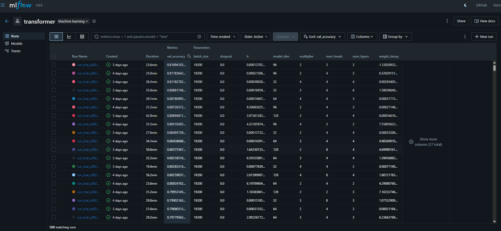
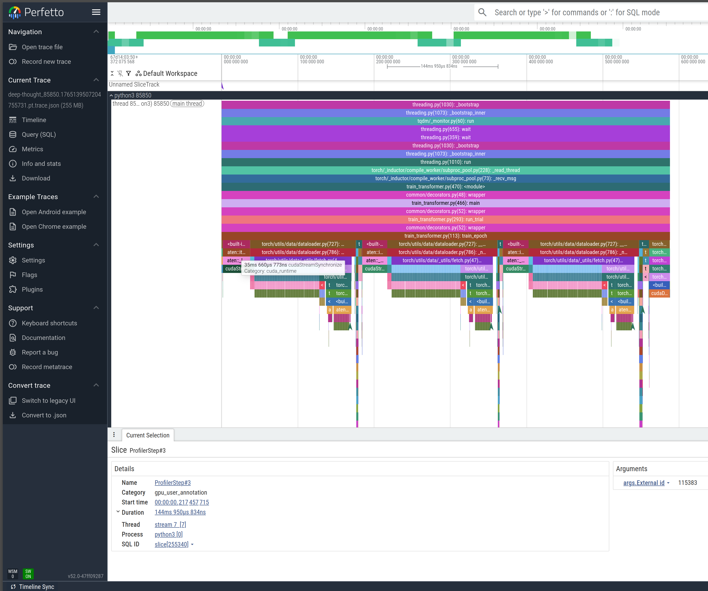
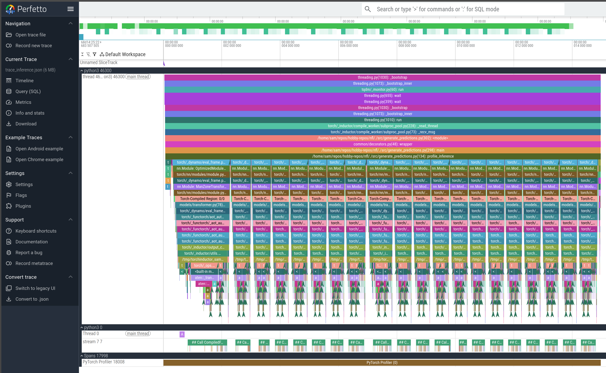

# Overview
This repo trains on the 2022 NFL Season Weeks 1 - 8 to predict man or zone pass coverage BEFORE the snap with machine learning. Week 9 plays are used for evaluation.

Two models are implemented:
- LSTM "naive" model that treats location tracking data as true time series inputs
- Transformer model that follows the SumerSports and SmitBajaj implementation

Both models yield about 88% accuracy in predicting man or pass coverage BEFORE the snap for all plays in Week 9 of the 2022 NFL season.

# Demo


### 2022 Week 9: Panthers at Bengals
Let's look at a play that goes swimmingly based on the coverage tell. On 2nd and 8 against Carolina, Joe Burrow gets his coverage answer right away. He motions Tyler Boyd (#83) across the formation and C. J. Henderson (#24) travels with him. That’s a clean man coverage indicator. Carolina is also crowding the line, showing pressure, so Burrow knows he’s in a quick-throw situation.

The route design plays perfectly off that read:
- Boyd’s motion and flat route pull Henderson toward the boundary
- Tight end Mitchell Wilcox (#84) pushes vertically and forces free safety Myles Hartsfield (#38) to gain depth in the middle of the field
- Reciever Tee Higgins (#85) is isolated one-on-one with cornerback Jaycee Horn (#8). Higgins is running a curl, and Horn is aligned eight yards off to protect himself against the vertical stem, leaving plenty of space for the break.

With man coverage confirmed and pressure likely, Burrow hits the top of his drop and fires in rhythm. Higgins snaps off his curl into the open window Horn has surrendered, and Burrow delivers an easy first down created by the motion tell, the pressure look, and the spacing built into the concept.


Fortunately the model spots the same man coverage tell! Once Boyd goes in motion about 3 seconds before the snap with Henderson mirroring his movements, the model's predicted man coverage probabilty shoots up from under 20% to 90% at the snap.


### 2022 Week 9: Vikings at Commanders
Now let's look at play that has a hiccup but still ends up working from the coverage tell. In a red zone snap in the fourth quarter, the Commanders are looking for a score on 2nd and 5. Reciever Curtis Samuel (#10) goes in motion to the left, and Vikings corner Chandon Sullivan (#39) follows him across the formation. That’s the indicator the Commanders want, straight man coverage.

Washington sells the run hard off the snap, and Vikings linebacker Erick Kendricks (#54) gets pulled downhill by the action. On the perimeter, Patrick Peterson (#7) is locked up one-on-one with Dax Milne (#15), the intended target.

However, the play isn’t completely clean. Vikings safety Harrison Smith (#22) doesn’t bite on the fake. Instead he hangs back, reads Commander's QB Taylor Heinicke’s eyes, and becomes a floating defender in space, squeezing the throwing lane as Milne makes his break. Even so, the design and the man tell still carry the play. Milne snaps his route toward the pylon with just enough separation, and Heinicke trusts the matchup. After a brief hitch as he confirms the leverage, he drives the ball to the front corner. Milne secures it and turns upfield through contact for the touchdown.


The model picks up the same man coverage tell as Vikings defender Chandon Sullivan follows Curtis Samuel's motion one second before the snap. A frame before the motion the model is prediction 40% man coverage probability but after the motion predicts 93% man coverage probabilty.


### 2022 Week 9: Dolphins at Bears
Finally let's look at a play where things aren't quite what we expect. On 3rd and 6, Miami sends tight end Durham Smythe (#81) in motion from a wide alignment into the backfield. Chicago safety DeAndre Houston-Carson (#36) tracks the motion inside, which normally reads as a man coverage indicator. Once Smythe sets, Houston-Carson communicates with linebacker Nicholas Morrow (#53), suggesting a possible switch in responsibilities and adding to the illusion that Chicago is matching the motion.

But post snap the picture changes. The Bears settle into Cover 2, with two deep safeties holding their shells and the underneath defenders sinking into their zone drops. The motion makes the coverage looks like man, but the structure is pure zone.

The ball is snapped and as Chicago’s curl-flat defender widens and the deep half safety stays high, a window opens on the left hash. With time in the pocket Dolphin's quaterback Tua Tagovailoa reads the post snap picture cleanly and fires a hole shot between the underneath defender and the half-field safety, dropping an 18-yard completion into the void Cover 2 naturally concedes.


Unfortunately, the model is not able to pick up on this disguise. The tight, mirrored defender-reciever alignement and defender tracking the motion acts as a false positive wtih the model mistankely predicting 85% man coverage probabilty moments before the snap. Of course, this turns into Zone so this would be a miss! Fortunately, the model does realize it's mistake after the snap and nose dives in man coverage probability, seeing the defenders drop in space as clear zone tells.


### Week 9 Overall
If we look across all plays in Week 9, our model on average is ~88% accurate in identifying man or zone pass coverage moments before the snap. The plot below illustrates the increasing confidence based on pre-snap movements and locations of players vs time


# Getting started

## Get the raw data
The raw data that was provided by NFL NextGenStats has been removed from the original Kaggle source. The orginal csv data has been transformed to parquet data and stored with git large file storage (LFS).

To retrieve the data, first install git LFS

```bash
# Install git lfs
sudo apt install git-lfs

# Navigate to where you cloned this repo
cd some-path/nfl

# Seperately run a pull with lfs
git lfs install
git lfs pull
```

This will fully populate `nfl/parquet/*` with:

`2021/`:
- `games.parquet`
- `pffScoutingData.parquet`
- `players.parquet`
- `plays.parquet`
- `tracking_week_1.parquet`
- `tracking_week_2.parquet`
- `tracking_week_3.parquet`
- `tracking_week_4.parquet`
- `tracking_week_5.parquet`
- `tracking_week_6.parquet`
- `tracking_week_7.parquet`
- `tracking_week_8.parquet`

`2022/`:
- `games.parquet`
- `player_play.parquet`
- `players.parquet`
- `plays.parquet`
- `tracking_week_1.parquet`
- `tracking_week_2.parquet`
- `tracking_week_3.parquet`
- `tracking_week_4.parquet`
- `tracking_week_5.parquet`
- `tracking_week_6.parquet`
- `tracking_week_7.parquet`
- `tracking_week_8.parquet`
- `tracking_week_9.parquet`

## Setup python virtual environment
This project uses `uv` for managing the python virtual environment. To install uv please see the official [documentation](https://docs.astral.sh/uv/getting-started/installation/) or install via CLI below:
```bash
curl -LsSf https://astral.sh/uv/install.sh | sh
```

To create and activate the virtual environment and setup git hooks (for auto linting and formatting), run the following:
```bash
uv sync --locked
uv run pre-commit install
```

## Run instructions
```bash

# Digest the raw data and create features
uv run src/create_features.py

# Train the model
uv run src/train_transformer.py

# Alternatively, you can run hyper-parameter optimization which will save the best model and parameters with
uv run src/train_transformer.py --tune

# Run inference on week 9
uv run src/generate_predictions.py 

# Create artifacts (plot on accuracy for week 9, classification report, and animations of plays)
uv run src/process_predictions.py
```

## Activating MLflow
This project uses MLflow to manage ML models and track experiments from hyper paremter optimization. To start MLflow simply:
```bash
# Make sure your virtual environment is sourced so the terminal recognizes mlflow
source .venv/bin/activate

# Start the tracking server
mlflow ui \
  --backend-store-uri sqlite:///mlflow.db \
  --host 0.0.0.0 \
  --port 5000
```

The last command will start the MLflow GUI at your local host loopback on port 5000: http://127.0.0.1:5000. Viewing MLflow will look something like this (note our results are after a 500 trial hyper-parameter optimization run with Ray Tune)



## Profiler
The PyTorch profiler is used for examining the training process and run time inference.

### Miscellaneous Profiling
You can profile any core scripts with:
```bash
# Generic profiling (uses the decorators to shown time the fcns take)
uv run src/the_script.py --profile

```

### Profiling Training

You can profile the training process with:
```bash
uv run src/train_transformer.py --profile
```

This will do three things:
1) Give timing results for each function call through the decorators `time_fcn`
2) Summarize the top CPU operations and GPU operations for training
3) Output `log/profiler/trace_training.json` which can be loaded into https://ui.perfetto.dev/ to view the timeline of training

An example of the top CPU and GPU operations (sorted by time) are shown below:
```sh
Top CPU ops:
-------------------------------------------------------  ------------  ------------  ------------  ------------  ------------  ------------  ------------  ------------  ------------  ------------  ------------  ------------  ------------  ------------  
                                                   Name    Self CPU %      Self CPU   CPU total %     CPU total  CPU time avg     Self CUDA   Self CUDA %    CUDA total  CUDA time avg       CPU Mem  Self CPU Mem      CUDA Mem  Self CUDA Mem    # of Calls  
-------------------------------------------------------  ------------  ------------  ------------  ------------  ------------  ------------  ------------  ------------  ------------  ------------  ------------  ------------  ------------  ------------  
                                          ProfilerStep*         0.06%     337.228us        93.40%     571.986ms     190.662ms       0.000us         0.00%      38.696ms      12.899ms           0 B           0 B           0 B     -24.61 MB             3  
enumerate(DataLoader)#_SingleProcessDataLoaderIter._...        42.21%     258.480ms        73.95%     452.836ms     150.945ms       0.000us         0.00%       0.000us       0.000us           0 B     -24.61 MB           0 B           0 B             3  
                                           aten::select        14.88%      91.123ms        18.94%     116.013ms       1.007us       0.000us         0.00%       0.000us       0.000us           0 B           0 B           0 B           0 B        115200  
                                             aten::item         0.00%       8.599us        16.61%     101.720ms      33.907ms       0.000us         0.00%       3.584us       1.195us           0 B           0 B           0 B           0 B             3  
                              aten::_local_scalar_dense         0.01%      33.658us        16.61%     101.711ms      33.904ms       3.584us         0.00%       3.584us       1.195us           0 B           0 B           0 B           0 B             3  
                                  cudaStreamSynchronize        16.60%     101.645ms        16.60%     101.645ms      33.882ms       0.000us         0.00%       0.000us       0.000us           0 B           0 B           0 B           0 B             3  
                                            aten::stack         4.07%      24.929ms        12.24%      74.931ms      12.489ms       0.000us         0.00%       0.000us       0.000us      24.61 MB           0 B           0 B           0 B             6  
                                        aten::unsqueeze         4.40%      26.957ms         5.98%      36.642ms       0.636us       0.000us         0.00%       0.000us       0.000us           0 B           0 B           0 B           0 B         57600  
                                       aten::as_strided         5.65%      34.607ms         5.65%      34.607ms       0.200us       0.000us         0.00%       0.000us       0.000us           0 B           0 B           0 B           0 B        172875  
                                  cudaDeviceSynchronize         5.18%      31.706ms         5.18%      31.706ms      31.706ms       0.000us         0.00%       0.000us       0.000us           0 B           0 B           0 B           0 B             1  
                                             train_step         1.61%       9.858ms         2.72%      16.653ms       5.551ms       0.000us         0.00%      37.244ms      12.415ms           0 B           0 B       1.87 MB      -6.22 GB             3  
                                              aten::cat         2.18%      13.330ms         2.18%      13.354ms       2.226ms       0.000us         0.00%       0.000us       0.000us      24.61 MB      24.61 MB           0 B           0 B             6  
autograd::engine::evaluate_function: CompiledFunctio...         0.01%      61.062us         1.33%       8.153ms       2.718ms       0.000us         0.00%      76.588ms      25.529ms           0 B           0 B      -6.22 GB    -225.00 KB             3  
                               CompiledFunctionBackward         0.06%     365.321us         1.32%       8.092ms       2.697ms       0.000us         0.00%      76.588ms      25.529ms           0 B           0 B      -6.22 GB           0 B             3  
## Call CompiledFxGraph fs2eo6ymbddiaqvlvl43h26r4o56...         0.83%       5.082ms         1.26%       7.727ms       2.576ms       0.000us         0.00%      76.588ms      25.529ms           0 B           0 B      -6.22 GB      -7.58 GB             3  
                             Torch-Compiled Region: 0/0         0.05%     294.930us         0.89%       5.433ms       1.811ms       0.000us         0.00%      36.715ms      12.238ms           0 B           0 B       6.22 GB           0 B             3  
                                       CompiledFunction         0.06%     365.452us         0.82%       5.033ms       1.678ms       0.000us         0.00%      36.715ms      12.238ms           0 B           0 B       6.22 GB           0 B             3  
## Call CompiledFxGraph fr2crjjm6bea2bu25s5lujbtakhq...         0.49%       2.994ms         0.76%       4.668ms       1.556ms       0.000us         0.00%      36.715ms      12.238ms           0 B           0 B       6.22 GB       5.74 GB             3  
                                       aten::pin_memory         0.14%     848.272us         0.56%       3.411ms     568.551us       0.000us         0.00%       0.000us       0.000us           0 B           0 B           0 B           0 B             6  
                                      aten::_pin_memory         0.22%       1.378ms         0.41%       2.482ms     413.705us       0.000us         0.00%       0.000us       0.000us           0 B           0 B           0 B           0 B             6  
                                            aten::copy_         0.20%       1.198ms         0.22%       1.317ms      43.893us       3.468ms         2.33%       3.468ms     115.599us           0 B           0 B           0 B           0 B            30  
                                               aten::mm         0.14%     828.708us         0.19%       1.133ms      11.108us      25.366ms        17.07%      25.366ms     248.691us           0 B           0 B           0 B           0 B           102  
                              Optimizer.step#AdamW.step         0.14%     859.283us         0.17%       1.032ms     344.061us       0.000us         0.00%     483.613us     161.204us           0 B           0 B           0 B           0 B             3  
                                         cuLaunchKernel         0.13%     789.408us         0.13%     789.408us       2.105us       0.000us         0.00%       0.000us       0.000us           0 B           0 B           0 B           0 B           375  
                                       cudaLaunchKernel         0.07%     412.417us         0.07%     412.417us       2.455us       0.000us         0.00%       0.000us       0.000us           0 B           0 B           0 B           0 B           168  
     aten::_scaled_dot_product_flash_attention_backward         0.01%      44.965us         0.07%     406.717us      67.786us       0.000us         0.00%      31.322ms       5.220ms           0 B           0 B       1.36 GB           0 B             6  
autograd::engine::evaluate_function: torch::autograd...         0.03%     154.030us         0.05%     327.798us       2.875us       0.000us         0.00%       0.000us       0.000us           0 B           0 B           0 B           0 B           114  
                        aten::_flash_attention_backward         0.01%      65.186us         0.05%     307.896us      51.316us      29.312ms        19.73%      31.322ms       5.220ms           0 B           0 B       1.36 GB      -8.05 GB             6  
                                               aten::to         0.00%      21.143us         0.04%     262.985us      17.532us       0.000us         0.00%       1.458ms      97.216us           0 B           0 B      25.27 MB           0 B            15  
                    Optimizer.zero_grad#AdamW.zero_grad         0.04%     247.293us         0.04%     247.293us      82.431us       0.000us         0.00%       0.000us       0.000us           0 B           0 B      -1.87 MB      -1.87 MB             3  
-------------------------------------------------------  ------------  ------------  ------------  ------------  ------------  ------------  ------------  ------------  ------------  ------------  ------------  ------------  ------------  ------------  
Self CPU time total: 612.384ms
Self CUDA time total: 148.575ms

Top GPU (CUDA kernel) ops:
-------------------------------------------------------  ------------  ------------  ------------  ------------  ------------  ------------  ------------  ------------  ------------  ------------  ------------  ------------  ------------  ------------  
                                                   Name    Self CPU %      Self CPU   CPU total %     CPU total  CPU time avg     Self CUDA   Self CUDA %    CUDA total  CUDA time avg       CPU Mem  Self CPU Mem      CUDA Mem  Self CUDA Mem    # of Calls  
-------------------------------------------------------  ------------  ------------  ------------  ------------  ------------  ------------  ------------  ------------  ------------  ------------  ------------  ------------  ------------  ------------  
                                          ProfilerStep*         0.00%       0.000us         0.00%       0.000us       0.000us     454.566ms       305.95%     454.566ms     151.522ms           0 B           0 B           0 B           0 B             3  
## Call CompiledFxGraph fs2eo6ymbddiaqvlvl43h26r4o56...         0.00%       0.000us         0.00%       0.000us       0.000us      76.829ms        51.71%      76.829ms      25.610ms           0 B           0 B           0 B           0 B             3  
autograd::engine::evaluate_function: CompiledFunctio...         0.01%      61.062us         1.33%       8.153ms       2.718ms       0.000us         0.00%      76.588ms      25.529ms           0 B           0 B      -6.22 GB    -225.00 KB             3  
                               CompiledFunctionBackward         0.06%     365.321us         1.32%       8.092ms       2.697ms       0.000us         0.00%      76.588ms      25.529ms           0 B           0 B      -6.22 GB           0 B             3  
## Call CompiledFxGraph fs2eo6ymbddiaqvlvl43h26r4o56...         0.83%       5.082ms         1.26%       7.727ms       2.576ms       0.000us         0.00%      76.588ms      25.529ms           0 B           0 B      -6.22 GB      -7.58 GB             3  
                                          ProfilerStep*         0.06%     337.228us        93.40%     571.986ms     190.662ms       0.000us         0.00%      38.696ms      12.899ms           0 B           0 B           0 B     -24.61 MB             3  
                                             train_step         1.61%       9.858ms         2.72%      16.653ms       5.551ms       0.000us         0.00%      37.244ms      12.415ms           0 B           0 B       1.87 MB      -6.22 GB             3  
## Call CompiledFxGraph fr2crjjm6bea2bu25s5lujbtakhq...         0.00%       0.000us         0.00%       0.000us       0.000us      37.069ms        24.95%      37.069ms      12.356ms           0 B           0 B           0 B           0 B             3  
                             Torch-Compiled Region: 0/0         0.05%     294.930us         0.89%       5.433ms       1.811ms       0.000us         0.00%      36.715ms      12.238ms           0 B           0 B       6.22 GB           0 B             3  
                                       CompiledFunction         0.06%     365.452us         0.82%       5.033ms       1.678ms       0.000us         0.00%      36.715ms      12.238ms           0 B           0 B       6.22 GB           0 B             3  
## Call CompiledFxGraph fr2crjjm6bea2bu25s5lujbtakhq...         0.49%       2.994ms         0.76%       4.668ms       1.556ms       0.000us         0.00%      36.715ms      12.238ms           0 B           0 B       6.22 GB       5.74 GB             3  
     aten::_scaled_dot_product_flash_attention_backward         0.01%      44.965us         0.07%     406.717us      67.786us       0.000us         0.00%      31.322ms       5.220ms           0 B           0 B       1.36 GB           0 B             6  
                        aten::_flash_attention_backward         0.01%      65.186us         0.05%     307.896us      51.316us      29.312ms        19.73%      31.322ms       5.220ms           0 B           0 B       1.36 GB      -8.05 GB             6  
                                               aten::mm         0.14%     828.708us         0.19%       1.133ms      11.108us      25.366ms        17.07%      25.366ms     248.691us           0 B           0 B           0 B           0 B           102  
void pytorch_flash::flash_bwd_dq_dk_dv_loop_seqk_par...         0.00%       0.000us         0.00%       0.000us       0.000us      23.759ms        15.99%      23.759ms       2.970ms           0 B           0 B           0 B           0 B             8  
void pytorch_flash::flash_bwd_dot_do_o_kernel<true, ...         0.00%       0.000us         0.00%       0.000us       0.000us       8.661ms         5.83%       8.661ms       1.083ms           0 B           0 B           0 B           0 B             8  
void pytorch_flash::flash_fwd_kernel<Flash_fwd_kerne...         0.00%       0.000us         0.00%       0.000us       0.000us       8.291ms         5.58%       8.291ms       1.184ms           0 B           0 B           0 B           0 B             7  
              aten::_scaled_dot_product_flash_attention         0.01%      32.816us         0.04%     215.414us      35.902us       0.000us         0.00%       7.121ms       1.187ms           0 B           0 B     485.37 MB           0 B             6  
                         aten::_flash_attention_forward         0.01%      51.505us         0.02%     140.659us      23.443us       7.121ms         4.79%       7.121ms       1.187ms           0 B           0 B     485.37 MB           0 B             6  
void pytorch_flash::flash_bwd_convert_dq_kernel<Flas...         0.00%       0.000us         0.00%       0.000us       0.000us       6.514ms         4.38%       6.514ms     814.277us           0 B           0 B           0 B           0 B             8  
triton_per_fused__to_copy_add_addmm_native_layer_nor...         0.00%       0.000us         0.00%       0.000us       0.000us       6.513ms         4.38%       6.513ms     814.161us           0 B           0 B           0 B           0 B             8  
ampere_fp16_s16816gemm_fp16_128x64_ldg8_f2f_stages_6...         0.00%       0.000us         0.00%       0.000us       0.000us       6.364ms         4.28%       6.364ms     397.772us           0 B           0 B           0 B           0 B            16  
triton_per_fused__to_copy_add_addmm_native_layer_nor...         0.01%      43.349us         0.01%      55.353us       9.225us       4.987ms         3.36%       4.987ms     831.101us           0 B           0 B           0 B           0 B             6  
void cutlass::Kernel2<cutlass_80_tensorop_f16_s16816...         0.00%       0.000us         0.00%       0.000us       0.000us       4.718ms         3.18%       4.718ms     589.702us           0 B           0 B           0 B           0 B             8  
triton_per_fused__to_copy_add_native_layer_norm_back...         0.00%       0.000us         0.00%       0.000us       0.000us       4.653ms         3.13%       4.653ms     581.618us           0 B           0 B           0 B           0 B             8  
triton_poi_fused_add_clone_select_backward_squeeze_t...         0.00%       0.000us         0.00%       0.000us       0.000us       4.652ms         3.13%       4.652ms     581.533us           0 B           0 B           0 B           0 B             8  
triton_poi_fused__to_copy_addmm_relu_threshold_backw...         0.00%       0.000us         0.00%       0.000us       0.000us       4.354ms         2.93%       4.354ms     544.302us           0 B           0 B           0 B           0 B             8  
          ampere_fp16_s1688gemm_fp16_256x64_ldg8_f2f_tn         0.00%       0.000us         0.00%       0.000us       0.000us       4.153ms         2.80%       4.153ms     519.086us           0 B           0 B           0 B           0 B             8  
ampere_fp16_s1688gemm_fp16_128x128_ldg8_f2f_stages_3...         0.00%       0.000us         0.00%       0.000us       0.000us       3.764ms         2.53%       3.764ms     235.225us           0 B           0 B           0 B           0 B            16  
triton_poi_fused__to_copy__unsafe_view_add_clone_squ...         0.00%       0.000us         0.00%       0.000us       0.000us       3.735ms         2.51%       3.735ms     533.548us           0 B           0 B           0 B           0 B             7  
-------------------------------------------------------  ------------  ------------  ------------  ------------  ------------  ------------  ------------  ------------  ------------  ------------  ------------  ------------  ------------  ------------  
Self CPU time total: 612.384ms
Self CUDA time total: 148.575ms

2025-12-08 15:53:09,345 - INFO - Function run_trial took 829.8971 s
```

An example of the timeline view (with the `trace_training.json` loaded into perfetto) is shown below:


### Profiling Inference
You can profile inference with:
```bash
uv run src/generate_predictions --profile
```

This will do three things:
1) Give timing results for each function call through the decorators `time_fcn`
2) Summarize the top CPU operations and GPU operations for inference
3) Output `log/profiler/trace_inference.json` which can be loaded into https://ui.perfetto.dev/ to view the timeline of inference for a single frame

An example of the top CPU and GPU operations (sorted by time) are shown below:
```sh
Top CPU ops (inference):
-------------------------------------------------------  ------------  ------------  ------------  ------------  ------------  ------------  ------------  ------------  ------------  ------------  ------------  ------------  ------------  ------------  
                                                   Name    Self CPU %      Self CPU   CPU total %     CPU total  CPU time avg     Self CUDA   Self CUDA %    CUDA total  CUDA time avg       CPU Mem  Self CPU Mem      CUDA Mem  Self CUDA Mem    # of Calls  
-------------------------------------------------------  ------------  ------------  ------------  ------------  ------------  ------------  ------------  ------------  ------------  ------------  ------------  ------------  ------------  ------------  
                                         inference_step         5.87%     848.468us        99.96%      14.444ms     722.205us       0.000us         0.00%       1.592ms      79.621us           0 B           0 B      10.00 KB           0 B            20  
                             Torch-Compiled Region: 0/0         5.33%     770.511us        92.22%      13.326ms     666.299us       0.000us         0.00%       1.592ms      79.621us           0 B           0 B      10.00 KB           0 B            20  
## Call CompiledFxGraph fbnp6yhlifehv3ftgsqc26y42ure...        26.63%       3.847ms        85.24%      12.317ms     615.834us       0.000us         0.00%       1.592ms      79.621us           0 B           0 B      10.00 KB    -330.00 KB            20  
                   aten::_transformer_encoder_layer_fwd         3.67%     529.978us        45.69%       6.601ms     165.031us       0.000us         0.00%       1.307ms      32.684us           0 B           0 B     340.00 KB      -1.66 MB            40  
                     aten::_native_multi_head_attention         4.95%     714.936us        26.17%       3.781ms      94.520us       0.000us         0.00%     704.765us      17.619us           0 B        -160 B     340.00 KB      -1.31 MB            40  
                                            aten::addmm         7.72%       1.115ms        10.86%       1.569ms      11.204us     545.444us        34.25%     545.444us       3.896us           0 B           0 B       1.64 MB       1.64 MB           140  
                                           aten::linear         1.24%     178.513us         9.66%       1.395ms      17.440us       0.000us         0.00%     341.024us       4.263us           0 B           0 B       1.31 MB           0 B            80  
                                       aten::layer_norm         1.48%     214.143us         7.21%       1.042ms      13.021us       0.000us         0.00%     181.889us       2.274us           0 B           0 B     696.50 KB     -62.00 KB            80  
                     aten::scaled_dot_product_attention         0.83%     119.704us         5.92%     854.840us      21.371us       0.000us         0.00%     363.741us       9.094us         160 B        -480 B     340.00 KB           0 B            40  
                                aten::native_layer_norm         2.22%     320.574us         5.73%     827.556us      10.344us     181.889us        11.42%     181.889us       2.274us           0 B           0 B     758.50 KB      -1.50 KB            80  
                                       cudaLaunchKernel         5.36%     774.946us         5.36%     774.946us       1.761us       0.000us         0.00%       0.000us       0.000us           0 B           0 B           0 B           0 B           440  
          aten::_scaled_dot_product_efficient_attention         0.75%     109.007us         5.09%     735.136us      18.378us       0.000us         0.00%     363.741us       9.094us         640 B           0 B     340.00 KB           0 B            40  
                                        aten::transpose         2.61%     376.871us         3.77%     545.166us       0.909us       0.000us         0.00%       0.000us       0.000us           0 B           0 B           0 B           0 B           600  
                                               aten::mm         2.72%     392.892us         3.73%     538.487us       8.975us     131.808us         8.28%     131.808us       2.197us           0 B           0 B           0 B           0 B            60  
                                            aten::empty         3.58%     517.471us         3.58%     517.471us       1.294us       0.000us         0.00%       0.000us       0.000us         568 B         568 B       1.07 MB       1.07 MB           400  
                                         cuLaunchKernel         3.57%     515.740us         3.57%     515.740us       1.984us       0.000us         0.00%       0.000us       0.000us           0 B           0 B           0 B           0 B           260  
                     aten::_efficient_attention_forward         1.40%     202.306us         3.38%     488.500us      12.213us     363.741us        22.84%     363.741us       9.094us         640 B          72 B     340.00 KB           0 B            40  
                                            aten::chunk         0.24%      34.494us         3.03%     437.408us      10.935us       0.000us         0.00%       0.000us       0.000us           0 B           0 B           0 B           0 B            40  
                                aten::_addmm_activation         1.95%     281.480us         2.81%     406.210us      10.155us     161.123us        10.12%     161.123us       4.028us           0 B           0 B     660.00 KB     660.00 KB            40  
                                            aten::split         0.43%      62.031us         2.79%     402.914us      10.073us       0.000us         0.00%       0.000us       0.000us           0 B           0 B           0 B           0 B            40  
                                           aten::narrow         1.50%     216.262us         2.36%     340.883us       2.841us       0.000us         0.00%       0.000us       0.000us           0 B           0 B           0 B           0 B           120  
                                             aten::add_         1.30%     188.066us         2.26%     327.209us       4.090us      90.461us         5.68%      90.461us       1.131us           0 B           0 B           0 B           0 B            80  
triton_poi_fused__native_batch_norm_legit_no_trainin...         1.47%     212.652us         2.11%     304.829us      15.241us      23.458us         1.47%      23.458us       1.173us           0 B           0 B           0 B           0 B            20  
                               TorchDynamo Cache Lookup         1.87%     269.642us         1.87%     269.642us      13.482us       0.000us         0.00%       0.000us       0.000us           0 B           0 B           0 B           0 B            20  
                                             aten::view         1.57%     226.514us         1.57%     226.514us       0.298us       0.000us         0.00%       0.000us       0.000us           0 B           0 B           0 B           0 B           760  
                                                aten::t         0.47%      67.309us         1.45%     209.726us       1.311us       0.000us         0.00%       0.000us       0.000us           0 B           0 B           0 B           0 B           160  
                                       aten::as_strided         1.41%     203.651us         1.41%     203.651us       0.283us       0.000us         0.00%       0.000us       0.000us           0 B           0 B           0 B           0 B           720  
              triton_per_fused_mean_permute_unsqueeze_2         1.06%     152.941us         1.34%     193.296us       9.665us      23.232us         1.46%      23.232us       1.162us           0 B           0 B           0 B           0 B            20  
triton_per_fused__unsafe_view_add_native_layer_norm_...         0.92%     133.017us         1.20%     173.498us       8.675us      25.952us         1.63%      25.952us       1.298us           0 B           0 B           0 B           0 B            20  
                                Activity Buffer Request         1.18%     170.179us         1.18%     170.179us     170.179us       0.000us         0.00%       0.000us       0.000us           0 B           0 B           0 B           0 B             1  
-------------------------------------------------------  ------------  ------------  ------------  ------------  ------------  ------------  ------------  ------------  ------------  ------------  ------------  ------------  ------------  ------------  
Self CPU time total: 14.449ms
Self CUDA time total: 1.592ms


Top CUDA ops (inference):
-------------------------------------------------------  ------------  ------------  ------------  ------------  ------------  ------------  ------------  ------------  ------------  ------------  ------------  ------------  ------------  ------------  
                                                   Name    Self CPU %      Self CPU   CPU total %     CPU total  CPU time avg     Self CUDA   Self CUDA %    CUDA total  CUDA time avg       CPU Mem  Self CPU Mem      CUDA Mem  Self CUDA Mem    # of Calls  
-------------------------------------------------------  ------------  ------------  ------------  ------------  ------------  ------------  ------------  ------------  ------------  ------------  ------------  ------------  ------------  ------------  
## Call CompiledFxGraph fbnp6yhlifehv3ftgsqc26y42ure...         0.00%       0.000us         0.00%       0.000us       0.000us      10.114ms       635.13%      10.114ms     505.697us           0 B           0 B           0 B           0 B            20  
                                         inference_step         5.87%     848.468us        99.96%      14.444ms     722.205us       0.000us         0.00%       1.592ms      79.621us           0 B           0 B      10.00 KB           0 B            20  
                             Torch-Compiled Region: 0/0         5.33%     770.511us        92.22%      13.326ms     666.299us       0.000us         0.00%       1.592ms      79.621us           0 B           0 B      10.00 KB           0 B            20  
## Call CompiledFxGraph fbnp6yhlifehv3ftgsqc26y42ure...        26.63%       3.847ms        85.24%      12.317ms     615.834us       0.000us         0.00%       1.592ms      79.621us           0 B           0 B      10.00 KB    -330.00 KB            20  
                   aten::_transformer_encoder_layer_fwd         3.67%     529.978us        45.69%       6.601ms     165.031us       0.000us         0.00%       1.307ms      32.684us           0 B           0 B     340.00 KB      -1.66 MB            40  
                     aten::_native_multi_head_attention         4.95%     714.936us        26.17%       3.781ms      94.520us       0.000us         0.00%     704.765us      17.619us           0 B        -160 B     340.00 KB      -1.31 MB            40  
                                            aten::addmm         7.72%       1.115ms        10.86%       1.569ms      11.204us     545.444us        34.25%     545.444us       3.896us           0 B           0 B       1.64 MB       1.64 MB           140  
                     aten::scaled_dot_product_attention         0.83%     119.704us         5.92%     854.840us      21.371us       0.000us         0.00%     363.741us       9.094us         160 B        -480 B     340.00 KB           0 B            40  
          aten::_scaled_dot_product_efficient_attention         0.75%     109.007us         5.09%     735.136us      18.378us       0.000us         0.00%     363.741us       9.094us         640 B           0 B     340.00 KB           0 B            40  
                     aten::_efficient_attention_forward         1.40%     202.306us         3.38%     488.500us      12.213us     363.741us        22.84%     363.741us       9.094us         640 B          72 B     340.00 KB           0 B            40  
fmha_cutlassF_f32_aligned_64x64_rf_sm80(PyTorchMemEf...         0.00%       0.000us         0.00%       0.000us       0.000us     363.741us        22.84%     363.741us       9.094us           0 B           0 B           0 B           0 B            40  
                                           aten::linear         1.24%     178.513us         9.66%       1.395ms      17.440us       0.000us         0.00%     341.024us       4.263us           0 B           0 B       1.31 MB           0 B            80  
void cutlass::Kernel2<cutlass_80_tensorop_s1688gemm_...         0.00%       0.000us         0.00%       0.000us       0.000us     300.132us        18.85%     300.132us       2.501us           0 B           0 B           0 B           0 B           120  
void cublasLt::splitKreduce_kernel<32, 16, int, floa...         0.00%       0.000us         0.00%       0.000us       0.000us     263.361us        16.54%     263.361us       1.646us           0 B           0 B           0 B           0 B           160  
                                       aten::layer_norm         1.48%     214.143us         7.21%       1.042ms      13.021us       0.000us         0.00%     181.889us       2.274us           0 B           0 B     696.50 KB     -62.00 KB            80  
                                aten::native_layer_norm         2.22%     320.574us         5.73%     827.556us      10.344us     181.889us        11.42%     181.889us       2.274us           0 B           0 B     758.50 KB      -1.50 KB            80  
void at::native::(anonymous namespace)::vectorized_l...         0.00%       0.000us         0.00%       0.000us       0.000us     181.889us        11.42%     181.889us       2.274us           0 B           0 B           0 B           0 B            80  
                                aten::_addmm_activation         1.95%     281.480us         2.81%     406.210us      10.155us     161.123us        10.12%     161.123us       4.028us           0 B           0 B     660.00 KB     660.00 KB            40  
                                               aten::mm         2.72%     392.892us         3.73%     538.487us       8.975us     131.808us         8.28%     131.808us       2.197us           0 B           0 B           0 B           0 B            60  
void cutlass::Kernel2<cutlass_80_tensorop_s1688gemm_...         0.00%       0.000us         0.00%       0.000us       0.000us     107.779us         6.77%     107.779us       2.694us           0 B           0 B           0 B           0 B            40  
                                             aten::add_         1.30%     188.066us         2.26%     327.209us       4.090us      90.461us         5.68%      90.461us       1.131us           0 B           0 B           0 B           0 B            80  
void at::native::vectorized_elementwise_kernel<4, at...         0.00%       0.000us         0.00%       0.000us       0.000us      90.461us         5.68%      90.461us       1.131us           0 B           0 B           0 B           0 B            80  
std::enable_if<!(false), void>::type internal::gemvx...         0.00%       0.000us         0.00%       0.000us       0.000us      74.561us         4.68%      74.561us       1.864us           0 B           0 B           0 B           0 B            40  
                        ampere_sgemm_32x32_sliced1x4_tt         0.00%       0.000us         0.00%       0.000us       0.000us      57.247us         3.59%      57.247us       2.862us           0 B           0 B           0 B           0 B            20  
std::enable_if<!(false), void>::type internal::gemvx...         0.00%       0.000us         0.00%       0.000us       0.000us      35.295us         2.22%      35.295us       1.765us           0 B           0 B           0 B           0 B            20  
triton_per_fused__unsafe_view_add_native_layer_norm_...         0.92%     133.017us         1.20%     173.498us       8.675us      25.952us         1.63%      25.952us       1.298us           0 B           0 B           0 B           0 B            20  
triton_per_fused__unsafe_view_add_native_layer_norm_...         0.00%       0.000us         0.00%       0.000us       0.000us      25.952us         1.63%      25.952us       1.298us           0 B           0 B           0 B           0 B            20  
        triton_per_fused_addmm_native_layer_norm_relu_4         0.84%     121.863us         1.10%     159.299us       7.965us      24.479us         1.54%      24.479us       1.224us           0 B           0 B           0 B           0 B            20  
        triton_per_fused_addmm_native_layer_norm_relu_4         0.00%       0.000us         0.00%       0.000us       0.000us      24.479us         1.54%      24.479us       1.224us           0 B           0 B           0 B           0 B            20  
triton_poi_fused__native_batch_norm_legit_no_trainin...         1.47%     212.652us         2.11%     304.829us      15.241us      23.458us         1.47%      23.458us       1.173us           0 B           0 B           0 B           0 B            20  
-------------------------------------------------------  ------------  ------------  ------------  ------------  ------------  ------------  ------------  ------------  ------------  ------------  ------------  ------------  ------------  ------------  
Self CPU time total: 14.449ms
Self CUDA time total: 1.592ms
```

An example of the timeline view (with the `trace_inference.json` loaded into perfetto) is shown below:


# Contributing

## Linting and Formatting
We are using [ruff](https://docs.astral.sh/ruff/) as a the linter and formatter. Ruff can be used with:

```bash
# Get check results
uv run ruff check .

# Get check results and apply fixes (recommend review these with git diff)
uv run ruff check . --fix

# Run formatter
uv run ruff format .
```

Note, if you followed instructions above to setup the git hook, ruff will run the linter (with auto fixing on) and formatting as a pre-commit git hook.

## Future Work
- Data
  - Incoporate the additional NGS data which likely will have the largest returns in increasing accuracy
  - Look into additional data augmentation techniques
- Model
  - Consider model improvements in transformer arch
  - Build per team model, do ANOVA, then highlight specific players that are giving tells on coverages
  - Build multiclass output model instead of binary classification
  - See if I can build a model to determine blitzer like red circle AWS at post snap
  - Add in confusion matrix, ROC curve, and prediction post snap accuracy to automatic predictions and not just in notebook
- Infra
  - Optimization
    - Switch to flash attention layer which can accelerate training
  - General
    - Get docker working and implemented in CI
    - Look back on mypy for type